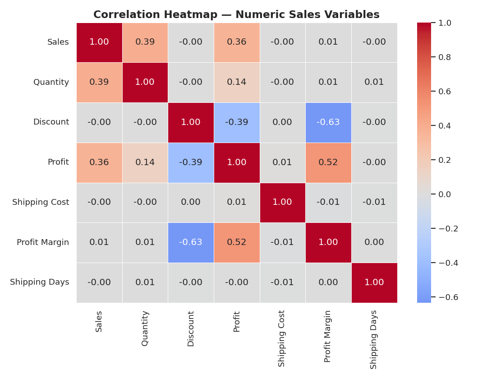
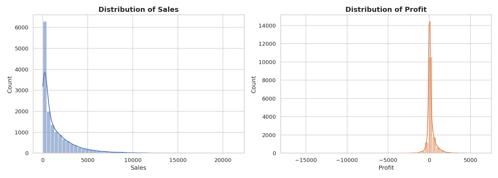
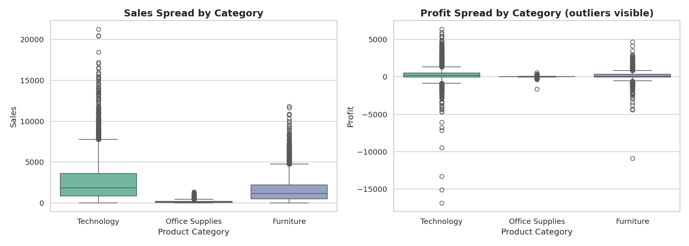
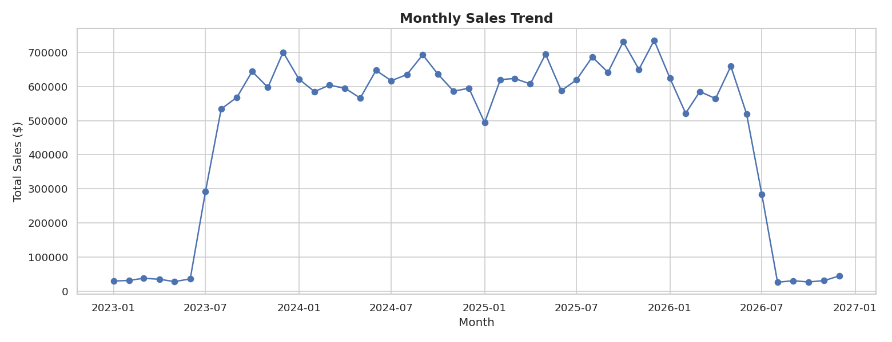
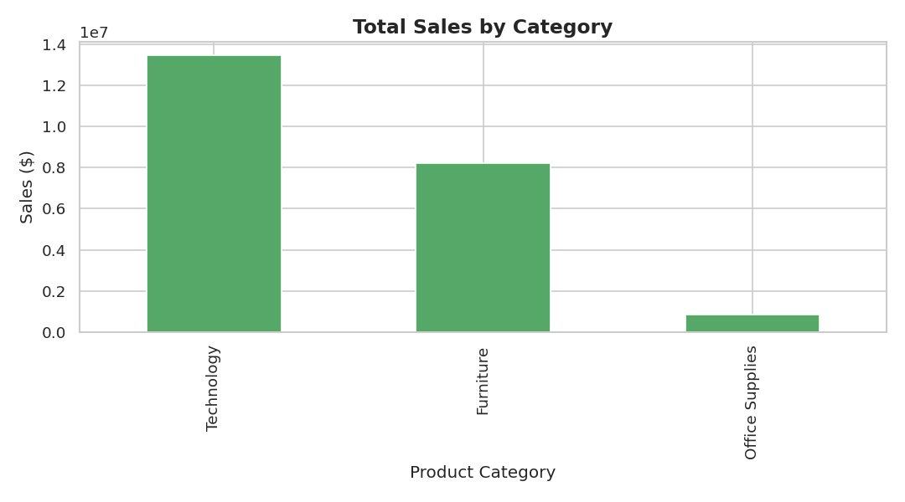
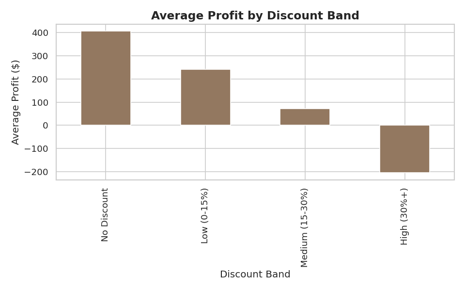
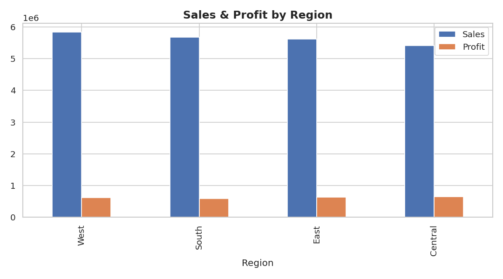
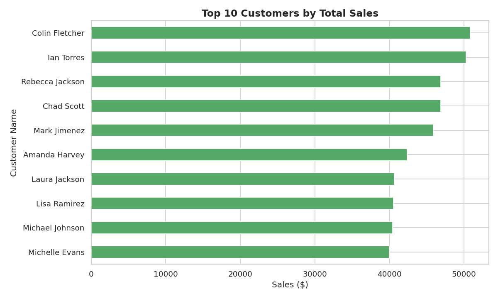
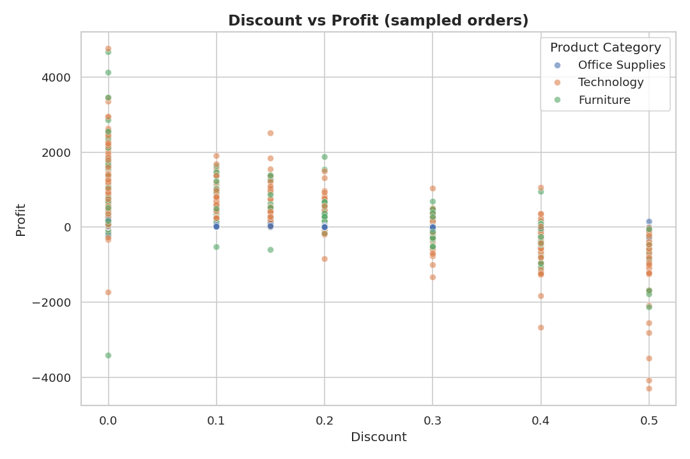

\newpage

# Abstract

This report documents an end-to-end data analytics project built around a simulated retail
store sales dataset of 15,200 cleaned orders (from a 15,504-row raw export) spanning three
product categories, four U.S. regions, and 1,400 unique customers. The project follows the
complete workflow used by data analysts in industry: a messy raw export is cleaned in both
Microsoft Excel and Python, modeled in a relational MySQL database, explored through
statistical analysis and 20 visualizations, and finally presented through an interactive
Power BI dashboard. The analysis surfaces 25 concrete business insights — most notably that
discount depth is a far stronger driver of profitability than product category or region, and
that a small number of very-large orders disproportionately drive profit. The project is
designed as a portfolio piece demonstrating practical, job-ready skills across the full data
analytics toolchain: Excel, Python, SQL, and Power BI.

\newpage

# Table of Contents

1. Introduction
2. Problem Statement
3. Objectives
4. Methodology
5. Dataset Description
6. Data Cleaning
7. SQL Database & Queries
8. Exploratory Data Analysis
9. Power BI Dashboard Design
10. Business Insights
11. Conclusion
12. Future Scope
13. References

\newpage

# 1. Introduction

Retail organizations generate sales data continuously across stores, regions, and product
lines, but raw exports from point-of-sale and e-commerce systems are rarely analysis-ready.
Missing fields, inconsistent text formatting, duplicate records, and mixed data types are the
norm rather than the exception. Before any meaningful analysis can happen, this data has to be
cleaned, validated, and structured.

This project simulates that full lifecycle using a realistic retail sales dataset. The goal is
not just to produce charts, but to demonstrate the complete workflow a data analyst would
follow at a real company: receiving a messy export, cleaning it defensibly, storing it in a
proper relational database, exploring it statistically, and packaging the findings into an
interactive dashboard that a non-technical stakeholder — a regional sales director, for
example — could use to make decisions.

# 2. Problem Statement

Store leadership needs answers to several recurring questions that raw transactional data
cannot answer on its own:

- Which regions, states, and product categories are driving the most revenue and profit?
- Is heavy discounting actually hurting profitability, and if so, by how much?
- Which customers and products matter most to the business, and which are underperforming?
- How consistent is order fulfillment (shipping time) across regions?
- What actionable, well-supported recommendations follow from the data?

Answering these questions requires moving the data through a cleaning and modeling pipeline
before any dashboard can be trusted.

# 3. Objectives

The project has six concrete objectives:

1. **Clean** a realistic, intentionally messy 15,000+ row retail sales export using both Excel
   and Python, producing a single trustworthy source of truth.
2. **Model** the cleaned data in a relational MySQL database with appropriate keys,
   constraints, and indexes.
3. **Explore** the dataset statistically in Python, covering distributions, correlations,
   trends over time, and category/region/customer breakdowns.
4. **Query** the database with 30+ SQL statements spanning basic retrieval through window
   functions, views, and stored procedures.
5. **Visualize** the findings in an interactive Power BI dashboard with KPIs, slicers,
   drill-through, and time-intelligence measures.
6. **Summarize** the analysis into clear business insights a non-technical stakeholder can act
   on.

# 4. Methodology

The project follows a linear pipeline, with each stage's output feeding the next:

```
Raw Data (messy) --> Excel (first-pass cleaning) --> Python (full cleaning + EDA)
      --> MySQL (modeling + SQL analysis) --> Power BI (dashboard) --> Business Insights
```

**Why this order?** Excel is used first because it mirrors how many analysts actually receive
data — as a spreadsheet — and demonstrates formula-based cleaning (`IF`, `INDEX`/`MATCH`,
`TEXT`, `ROUND`, `SUMIF`/`SUMIFS`, `COUNTIF`) on a representative sample. Python then performs
the same cleaning logic at full scale, since spreadsheet formulas become impractical at
15,000+ rows with complex imputation rules. The cleaned dataset is loaded into MySQL, which
provides a proper relational structure, enforced constraints, and a query surface for both ad
hoc SQL analysis and the Power BI connection. Power BI sits on top as the presentation layer,
translating the SQL/Python analysis into an interactive tool for non-technical stakeholders.

# 5. Dataset Description

The dataset simulates retail order-level data with 19 original columns:

| Column | Description |
|---|---|
| Order ID | Unique order identifier |
| Order Date / Ship Date | Order placement and shipment dates |
| Customer ID / Customer Name | Customer identifiers |
| Segment | Consumer, Corporate, or Home Office |
| City / State / Region | Delivery location |
| Product Category / Sub Category / Product Name | Product hierarchy |
| Sales | Order revenue |
| Quantity | Units ordered |
| Discount | Discount rate applied |
| Profit | Net profit on the order |
| Shipping Cost | Cost to ship the order |
| Payment Mode | Payment method used |
| Order Priority | Fulfillment priority level |

The raw export (`Dataset/sales.csv`, `Dataset/Raw_Data.xlsx`) intentionally contains:

- Missing values across six columns (Customer Name, City, Discount, Shipping Cost, Order
  Priority, Profit)
- Approximately 2% exact duplicate rows
- Inconsistent text casing and stray whitespace in categorical fields
- Dates stored in four different string formats within the same column
- Sales and Quantity values occasionally stored as text with stray currency symbols
- A small number of extreme negative profit outliers

After cleaning, the dataset (`Dataset/Cleaned_Data.csv`, `Dataset/Cleaned_Data.xlsx`) contains
**15,200 rows and 28 columns** — the original 19 plus 9 engineered features described in
Section 6.

# 6. Data Cleaning

## 6.1 Excel Cleaning (Sample-Based Demonstration)

`Excel/Data Cleaning.xlsx` demonstrates the cleaning logic on a 500-row sample using native
Excel formulas:

- **Text cleanup:** `=PROPER(TRIM(...))` to fix inconsistent city name casing and stray
  whitespace.
- **Numeric conversion:** `=ROUND(VALUE(SUBSTITUTE(TRIM(...),"$","")),2)` to strip currency
  symbols from Sales values stored as text and convert them to proper numbers.
- **Date parsing:** `=IFERROR(DATEVALUE(...),"Check Format")` to convert mixed-format date
  strings into real Excel date values, flagging any that fail to parse.
- **Missing-value handling:** `=IF(...="",<fallback>,...)` for Discount and Order Priority, and
  an `INDEX`/`MATCH` lookup wrapped in `IFERROR` to fill missing Customer Names from another
  row sharing the same Customer ID.
- **Feature engineering:** a nested `IF` formula buckets each order into a Small/Medium/
  Large/Very Large value tier.

`Excel/Pivot Tables.xlsx` builds pivot-style summary tables against the **full 15,200-row**
cleaned dataset using `SUMIF`, `SUMIFS`, and `COUNTIF` — category summary, regional summary,
segment summary, and a two-criteria (year + month) monthly trend table — each paired with a
native Excel chart.

## 6.2 Python Cleaning (Full Dataset)

`Python/data_cleaning.py` implements the equivalent logic at full scale, structured as a
sequence of discrete, testable functions:

1. **`clean_text_columns`** — strips whitespace, standardizes casing to title case across all
   categorical fields, and fixes known city-name variants (e.g., "St Louis" → "St. Louis").
2. **`clean_numeric_columns`** — strips stray currency symbols and whitespace from Sales and
   Quantity, then casts every numeric column to its proper dtype.
3. **`clean_dates`** — parses the four mixed date-string formats into a single consistent
   `datetime64` dtype using pandas' flexible date parser.
4. **`handle_missing_values`** — applies business-appropriate imputation rules rather than a
   single blanket strategy:
   - Customer Name is filled by looking up another order from the same Customer ID.
   - City is filled with the most common city recorded for that State.
   - Discount defaults to 0 (no discount) when missing.
   - Shipping Cost is filled with the median shipping cost for that product category.
   - Order Priority is filled with the overall mode.
   - Profit, when missing, is estimated from Sales, Discount, and Shipping Cost using a
     simplified margin assumption.
   - Any row still missing a critical key field (Order ID, dates, Sales, Quantity) is dropped.
5. **`remove_duplicates`** — removes exact duplicate orders identified by the combination of
   Order ID, Product Name, and Customer ID.
6. **`flag_outliers`** — flags statistical outliers in Profit using the interquartile range
   (IQR) method. Outliers are flagged, not deleted, so they remain available for root-cause
   analysis rather than being silently discarded.
7. **`engineer_features`** — adds nine new columns: Order Year, Order Month, Order Month Name,
   Order Quarter, Shipping Days, Profit Margin, Discount Band, and Order Value Tier.
8. **`final_type_pass`** — rounds monetary columns to two decimal places and finalizes integer
   dtypes.

Running the pipeline reduces the raw 15,504-row export to a clean **15,200-row, 28-column**
dataset with zero remaining missing values, ready for SQL loading and analysis.

# 7. SQL Database & Queries

## 7.1 Schema Design

`MySQL/database.sql` creates the `store_sales_db` database with two tables:

- **`customers`** — a dimension table (Customer ID, Customer Name, Segment) with Customer ID
  as the primary key, used to demonstrate proper relational normalization and join logic.
- **`sales`** — the main fact table, with an auto-incrementing surrogate primary key
  (`row_id`), a foreign key reference to `customers`, `CHECK` constraints on Sales, Quantity,
  Discount, and Shipping Cost, and a unique index on the (Order ID, Product Name, Customer ID)
  combination to prevent duplicate loads.

Four additional indexes are created on Order Date, Region, Product Category, and Customer ID
— the four fields most frequently filtered on in downstream SQL queries and the Power BI
dashboard — to keep those queries performant as the dataset grows.

## 7.2 Query Coverage

`MySQL/sql_queries.sql` contains over 30 queries organized into eight sections:

1. **Basic retrieval** — `SELECT`, `WHERE`, `ORDER BY`, `LIMIT`, `DISTINCT`, `BETWEEN`, `IN`,
   `LIKE`.
2. **Aggregates & grouping** — `GROUP BY`, `HAVING`, `CASE`, and core aggregate functions
   (`SUM`, `COUNT`, `AVG`) applied to revenue, profit, and order-count questions.
3. **Joins** — `INNER JOIN`, `LEFT JOIN`, and `RIGHT JOIN` between the `sales` fact table and
   `customers` dimension.
4. **Subqueries & CTEs** — a correlated subquery identifying above-average-spend customers,
   and two `WITH`-clause CTEs computing customer lifetime value and category profit margin.
5. **Window functions** — a running total of monthly revenue, a `RANK()` of products within
   each category, and a `LAG()`-based month-over-month growth calculation.
6. **Views** — `vw_regional_performance` and `vw_top_customers`, reusable summary views that
   can also be queried directly from Power BI.
7. **Stored procedures** — `sp_region_sales_summary` (parametrized by region and date range)
   and `sp_top_products_by_profit` (parametrized by result count).
8. **Business-insight queries** — customer lifetime value by segment, profit erosion by
   discount band, average shipping days by region, and revenue concentration among the top
   customer decile.

# 8. Exploratory Data Analysis

`Python/eda.ipynb` runs the statistical exploration against the full cleaned dataset and
produces 20 saved chart images in `Python/eda_images/`, covering:

- **Data overview** — `.info()` and `.describe()` summaries, and a post-cleaning missing-value
  check confirming zero remaining nulls.
- **Correlation analysis** — a heatmap across Sales, Quantity, Discount, Profit, Shipping
  Cost, Profit Margin, and Shipping Days.
- **Distributions** — histograms of Sales and Profit, and boxplots of both by product
  category.
- **Trends over time** — a monthly sales line chart and a yearly sales-by-category bar chart.
- **Category & sub-category performance** — bar charts of total sales by category and
  sub-category.
- **Profitability** — average profit margin by category, and average profit by discount band.
- **Regional performance** — a combined sales/profit bar chart by region, a revenue-share pie
  chart, and a top-10-states bar chart.
- **Customer segmentation** — segment-level sales/profit bars, a segment share pie/donut
  chart, and a top-10-customers bar chart.
- **Product performance** — top-10 products by sales and the 10 least profitable products.
- **Operational patterns** — order counts by priority and payment mode, and a shipping-days
  distribution histogram.
- **Discount-profit relationship** — a scatter plot of discount versus profit across a sample
  of orders, colored by category.

The correlation analysis is the most consequential finding of the EDA stage: discount and
profit show a meaningfully negative correlation (r ≈ -0.39), stronger than the relationship
between sales and profit (r ≈ 0.36) — meaning discount policy, not category mix or order size
alone, is the primary lever affecting margin in this dataset.

## 8.1 Selected Charts



\newpage





\newpage





\newpage





\newpage





# 9. Power BI Dashboard Design

The dashboard design is documented in full in
`PowerBI/DAX_Measures_and_Build_Guide.md`, structured around three pages.

## 9.1 Data Model

The cleaned dataset connects to Power BI either directly from `Dataset/Cleaned_Data.csv` or
via a live MySQL connection to `store_sales_db`. A dedicated `DateTable` is created with
`CALENDAR()` and marked as the model's official date table to support time-intelligence
functions (`TOTALYTD`, `SAMEPERIODLASTYEAR`, etc.).

## 9.2 DAX Measures

Measures are grouped into four families: core KPIs (Total Sales, Total Profit, Total Orders,
Average Order Value, Profit Margin %), time intelligence (YoY, MTD, QTD, YTD, running total),
rank/contribution measures (product and customer sales rank, percent of total, top-10
calculations), and discount/profitability measures (average discount, profit per order,
high-discount profit loss, outlier order count).

## 9.3 Pages & Visuals

- **Page 1 — Executive Overview:** five KPI cards, a monthly sales trend line (with a
  prior-year comparison), a regional clustered bar chart, a category/sub-category treemap, a
  segment donut chart, and a state-level map.
- **Page 2 — Product & Category Performance:** a stacked bar chart of sub-category sales by
  segment, a ribbon chart of category sales by month, a discount-versus-margin scatter plot,
  and a top-10-products table.
- **Page 3 — Customer & Regional Insights:** a monthly sales waterfall chart, a payment-mode
  pie chart, a top-10-customers bar chart, and a state-level table with conditional
  formatting.

## 9.4 Interactivity

Five synced slicers (date range, region, state, category, segment) appear on every page. A
drill-through page filters to a single customer's order history. A custom tooltip page shows
monthly trend and margin data on hover over the regional chart. Bookmarks paired with
navigation buttons allow one-click movement between pages.

## 9.5 Layout Mockup

The image below is a design mockup (built from the real cleaned dataset, but laid out in
Python rather than exported live from Power BI Desktop) showing the intended Page 1 layout —
KPI cards across the top, trend and category visuals in the middle, and a synced slicer bar
at the bottom.


# 10. Business Insights

The full list of 25 business insights is documented in `Business_Insights.md`. The
highest-priority findings for leadership are:

1. **Technology drives both revenue and profit** ($13.48M revenue, $1.5M profit — roughly 60%
   of total revenue), making it the category most worth protecting and expanding.
2. **Discount depth is the strongest lever on profitability observed in the data.** Orders
   with no discount average $407 profit; orders discounted 30%+ average a $205 *loss* — a
   roughly $600 swing per order between the two extremes.
3. **Regional performance is comparatively balanced** — the top and bottom regions by revenue
   are within about 8% of each other — so growth strategy should not assume one region is
   structurally weak.
4. **Central region converts revenue into profit most efficiently**, posting the highest total
   profit despite the lowest total revenue among the four regions.
5. **Shipping time varies sharply by region** (1.8 days in the South versus 4.1 days in the
   East), a clear operational gap worth investigating independently of the sales analysis.
6. **Customer concentration is moderate, not extreme** — the top 10% of customers by spend
   generate about 20% of revenue, suggesting a broadly healthy customer base rather than
   dependence on a small number of accounts.

# 11. Conclusion

This project demonstrates a complete, realistic data analytics workflow: transforming a
deliberately messy 15,000+ row retail export into a clean, well-modeled dataset, analyzing it
statistically in Python, structuring and querying it in MySQL with production-grade schema
design, and translating the findings into a decision-ready Power BI dashboard. The strongest
finding — that discount policy, not category or region, is the dominant driver of profit
erosion — is exactly the kind of counter-intuitive, well-supported insight a good analytics
project should surface. The project's layered structure (Excel → Python → MySQL → Power BI)
mirrors how analytics work is actually organized on real teams, making it a representative
demonstration of job-ready data analyst skills.

# 12. Future Scope

- Incorporate a returns/refunds table to recompute profit net of returns.
- Automate the full pipeline (Excel/Python → MySQL → Power BI refresh) on a schedule.
- Build a customer-churn or next-purchase-likelihood model to prioritize retention outreach.
- Add native Power BI forecasting to the monthly sales trend visual.
- Expand geographic analysis with drive-time or logistics-cost data to explain the regional
  shipping-time gap identified in Section 10.

# 13. References

- Dataset generated for this project to simulate realistic retail sales data with intentional
  data-quality issues for cleaning practice.
- Microsoft Excel, Python (Pandas/NumPy/Matplotlib/Seaborn), MySQL 8.0, and Power BI Desktop
  documentation.

\newpage

# Appendix A — Full Data Dictionary (Cleaned Dataset)

| # | Column | Type | Description |
|---|---|---|---|
| 1 | Order ID | Text | Unique order identifier (e.g., ORD-3001) |
| 2 | Order Date | Date | Date the order was placed |
| 3 | Ship Date | Date | Date the order was shipped |
| 4 | Customer ID | Text | Unique customer identifier |
| 5 | Customer Name | Text | Customer's full name |
| 6 | Segment | Text | Consumer, Corporate, or Home Office |
| 7 | City | Text | Delivery city |
| 8 | State | Text | Delivery state |
| 9 | Region | Text | West, East, Central, or South |
| 10 | Product Category | Text | Furniture, Office Supplies, or Technology |
| 11 | Sub Category | Text | Product sub-category (e.g., Chairs, Binders, Phones) |
| 12 | Product Name | Text | Specific product ordered |
| 13 | Sales | Decimal | Order revenue in USD |
| 14 | Quantity | Integer | Units ordered |
| 15 | Discount | Decimal | Discount rate applied (0–1) |
| 16 | Profit | Decimal | Net profit on the order in USD |
| 17 | Shipping Cost | Decimal | Cost to ship the order in USD |
| 18 | Payment Mode | Text | Credit Card, Debit Card, UPI, Cash on Delivery, or Net Banking |
| 19 | Order Priority | Text | Low, Medium, High, or Critical |
| 20 | Is_Profit_Outlier | Boolean | Flagged by the IQR method during cleaning |
| 21 | Order Year | Integer | Engineered from Order Date |
| 22 | Order Month | Integer | Engineered from Order Date |
| 23 | Order Month Name | Text | Engineered from Order Date |
| 24 | Order Quarter | Integer | Engineered from Order Date |
| 25 | Shipping Days | Integer | Ship Date minus Order Date |
| 26 | Profit Margin | Decimal | Profit divided by Sales |
| 27 | Discount Band | Text | No Discount / Low / Medium / High, engineered from Discount |
| 28 | Order Value Tier | Text | Small / Medium / Large / Very Large, engineered from Sales |

# Appendix B — Sample SQL (Window Function)

Month-over-month sales growth, using `LAG()` to compare each month to the previous one:

```sql
SELECT order_year, order_month, monthly_sales,
       LAG(monthly_sales) OVER (ORDER BY order_year, order_month) AS prev_month_sales,
       ROUND(
         (monthly_sales - LAG(monthly_sales) OVER (ORDER BY order_year, order_month))
         / LAG(monthly_sales) OVER (ORDER BY order_year, order_month) * 100, 2
       ) AS mom_growth_pct
FROM (
    SELECT order_year, order_month, SUM(sales) AS monthly_sales
    FROM sales
    GROUP BY order_year, order_month
) monthly
ORDER BY order_year, order_month;
```

The complete set of 30+ queries — covering joins, CTEs, views, and stored procedures — is in
`MySQL/sql_queries.sql`.

# Appendix C — Sample DAX Measure (Time Intelligence)

Year-over-year sales growth, built on top of a dedicated `DateTable`:

```dax
Sales LY =
CALCULATE ( [Total Sales], SAMEPERIODLASTYEAR ( DateTable[Date] ) )

Sales YoY % =
DIVIDE ( [Total Sales] - [Sales LY], [Sales LY] )
```

The complete DAX measure library and page-by-page visual spec is in
`PowerBI/DAX_Measures_and_Build_Guide.md`.
